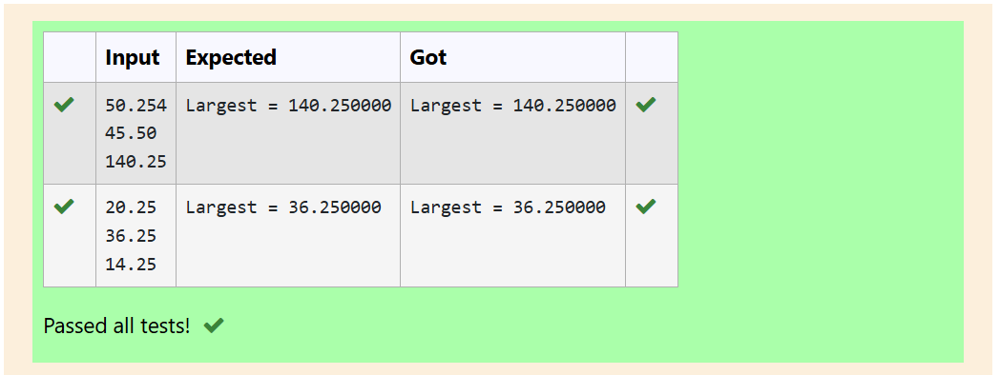
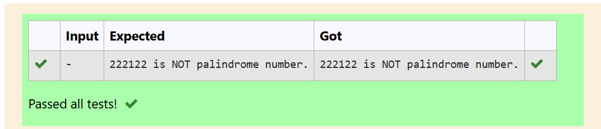
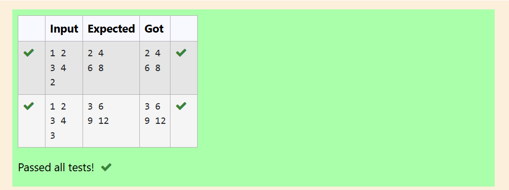
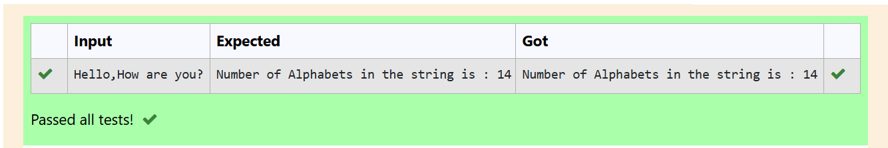
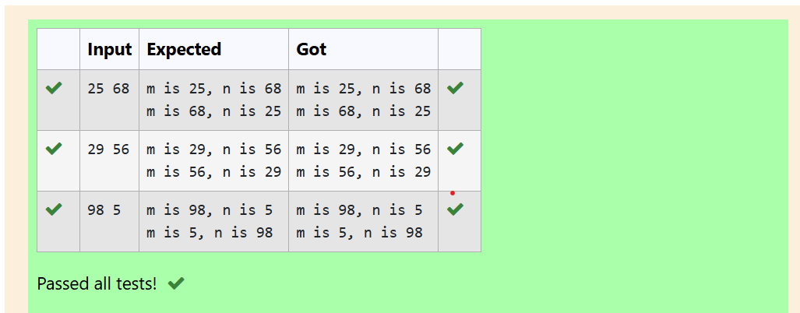

# MODULE-5

---
# EXP NO:21 C PROGRAM TO FIND LARGEST OF THREE NUMBERS USING POINTERS

## Aim:

Write a C program to find the largest of three decimal numbers using pointers and a function.

## Algorithm:

1. Start.

2. Include the required header: stdio.h for input/output.

3. Define a function fun that accepts three float pointers (*a, *b, *c) and returns a float.

4. Inside fun, use the conditional (ternary) operator to compare the values pointed to by the pointers (*a, *b, *c) and return the largest one.

5. In the main function, declare three float variables (n1, n2, n3).

6. Read the three decimal numbers from the user.

7. Call the fun function, passing the addresses of the three variables (&n1, &n2, &n3).

8. Print the returned largest value.

9. Stop.

## Program:
```
#include <stdio.h>

float fun(float *a, float *b, float *c)
{
    return ((*a > *b) && (*a > *c) ? *a : (*b > *c) ? *b : *c);
}

int main()
{
    float n1, n2, n3;
    
    scanf("%f", &n1);
    scanf("%f", &n2);
    scanf("%f", &n3);
    
    printf("Largest = %f", fun(&n1, &n2, &n3));
    
    return 0;
}

```
## Output:

## Result:

The C program to find the largest of three decimal numbers using pointers and a function was executed successfully.

---
#
---
# EXP NO:22 C PROGRAM TO CHECK PALINDROME USING RECURSION

## Aim:

Write a C program to determine if a given integer is a palindrome number using a recursive function.

## Algorithm:

1. Start.

2. Declare global variables digit and result (initialized to 0) to store the extracted digit and the reversed number, respectively.

3. Define a recursive function, pal(int n), which takes the number to be reversed as input.

4. Inside pal(n):
    - a.  Extract the last digit: digit = n % 10.
    - b.  Append the digit to result: result = result * 10 + digit.
    - c.  If $n \neq 0$, recursively call pal(n / 10) to process the remaining digits.

5. In the main function:
    - a.  Initialize the number to be checked, n = 222122.
    - b.  Call the recursive function: pal(n).
    - c.  Compare the original number n with the reversed number result.
    - d.  If they are equal, the number is a palindrome; otherwise, it is not.
    - e.  Print the appropriate result.

6. Stop.

## Program:
```
#include <stdio.h>
int digit, result = 0;

void pal(int n)
{
    digit = n % 10;
    result = result * 10 + digit;
    
    if (n != 0)
    {
        pal(n / 10);
    }
    return;
}

int main()
{
    int n = 222122;
    pal(n);
    
    if (result != n) 
    {
        printf("%d is NOT palindrome number.\n", n);
    }
    else
    {
        printf("%d is palindrome number.\n", n);
    }
    
    return 0;
}
```

## Output:
:

## Result:

The C program to check whether a given number is a palindrome using a recursive function was executed successfully.

---
#
---
# EXP NO:23 C PROGRAM FOR SCALAR MULTIPLICATION OF A MATRIX

## Aim:

Write a C program to read the elements of a $2 \times 2$ matrix and a single scalar value, then perform and display the scalar multiplication of the matrix.

## Algorithm:

1. Start.

2. Include the necessary header file: stdio.h.

3. In the main function, declare a $2 \times 2$ integer matrix mat and an integer variable s for the scalar.

4. Use nested for loops (where $i$ is for rows and $j$ is for columns) to read the 4 elements of the $2 \times 2$ matrix from the user and store them in mat[i][j].

5. Read the scalar multiplier value s from the user.

6. Use another set of nested for loops to iterate through the matrix again.

7. Inside the inner loop, calculate the result by multiplying the scalar s with the current element: s * mat[i][j].

8. Print the calculated result followed by a space.

9. After the inner loop finishes (end of a row), print a newline character (\n) to move to the next row for display.

10. Stop.

## Program:
```
#include <stdio.h>

int main()
{
    int mat[2][2], s;
    
    for (int i = 0; i < 2; i++) 
    {
        for (int j = 0; j < 2; j++) 
        {
            scanf("%d", &mat[i][j]);
        }
    }
    
    scanf("%d", &s);
    
    for (int i = 0; i < 2; printf("\n"), i++) 
    {
        for (int j = 0; j < 2; j++) 
        {
            printf("%d ", s * mat[i][j]);
        }
    }
    
    return 0;
}
```

## Output:

## Result:

The C program to perform scalar multiplication on a $2 \times 2$ matrix was executed successfully.

---
#
---
# EXP NO:24 C PROGRAM TO COUNT ALPHABETS IN A STRING

## Aim:

Write a C program to count the total number of alphabets (both lowercase and uppercase) present in a given string without using standard library functions like isalpha().

## Algorithm:

1. Start.

2. Include necessary header files: stdio.h and string.h.

3. In the main function, declare a character array str (size 100) to store the input string, and two integer variables i (index, initialized to 0) and c (alphabet count, initialized to 0).

4. Read the entire string, including spaces, using scanf("%[^\n]", str).

5. Start a while loop that continues until the null terminator (\0) of the string is reached.

6. Inside the loop, use an if condition to check if the character str[i] is an alphabet:

7. The condition checks if the character is between 'a' and 'z' OR between 'A' and 'Z'.

8. If the condition is true, increment the alphabet counter c.

9. Increment the index i to move to the next character.

10. After the loop finishes, print the final count of alphabets stored in c.

11. Stop.

## Program:
```
#include <stdio.h>
#include <string.h>

int main()
{
    char str[100];
    scanf("%[^\n]", str);
    
    int i = 0, c = 0;
    
    while(str[i] != '\0')
    {
        char ch = str[i];
        
        if ((ch >= 'a' && ch <= 'z') || (ch >= 'A' && ch <= 'Z')) 
        {
            c++;
        }
        i++;
    }
    
    printf("Number of Alphabets in the string is : %d\n", c);
    
    return 0;
}
```

## Output:


## Result:

The C program to count the total number of alphabets in a given string without using built-in functions was successfully executed.

---
#
---

# EXP NO:25 C PROGRAM TO SWAP TWO VALUES USING POINTERS

## Aim:

Write a C program to swap the values of two integer variables by defining a function that uses pointers for call by reference.

## Algorithm:

1. Start.

2. Include the necessary header file: stdio.h.

3. Define a void function called fun that accepts two integer pointers, *a and *b, as arguments. This function will perform the swap.

4. Inside fun:

5. Print the initial values of the variables using the dereference operator (*a and *b).

6. Declare a temporary integer variable temp.

7. Store the value of *b into temp.

8. Store the value of *a into *b (completing the first part of the swap).

9. Store the value of temp into *a (completing the second part of the swap).

10.Print the swapped values of the variables.

11. In the main function:

12. Declare two integer variables, a and b.

13. Read two input values from the user and store them in a and b.

14. Call the fun function, passing the addresses of a and b (using the address-of operator &).

15. Stop.

## Program:
```
#include <stdio.h>

void fun(int *a, int *b)
{
    printf("m is %d, n is %d", *a, *b);
    int temp = *b;
    *b = *a;
    *a = temp;
    printf("\nm is %d, n is %d", *a, *b);
}

int main()
{
    int a, b;
    scanf("%d %d", &a, &b);
    fun(&a, &b);
    return 0;
}
```

## Output:

## Result:

The C program to swap two values using a function with pointers (call by reference) was successfully executed and verified.

---
